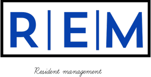
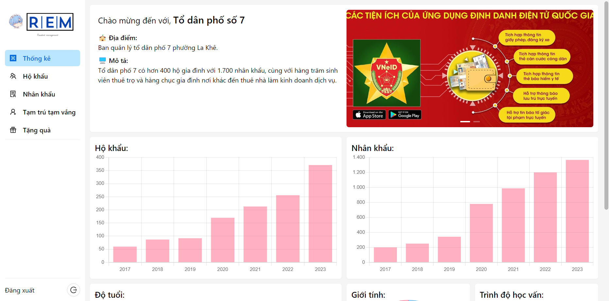

<p align="center">
  <!--
  -->
  
</p>

<p align="center">
  <a href="https://reactjs.org/"></a><!--
  --><a href="https://ant.design/"></a><!--
  --><a href="https://laravel.com/"></a>
</p>

## What is ReM ?

A resident management web application for HUST Software Engineering Courses

<p>
  
</p>

## Table of Contents

- [System requirements](#system-requirements)
- [Setup and Configuration](#setup-and-configuration)
- [Usage](#usage)
- [License](#license)

## System requirements

- Docker >= 20.10
- Docker compose plugin

## Setup and Configuration

To get a local copy of the project up and running, follow these steps:

1. Start docker container:

```bash
make devup
```

This will create a `.env` file in the root directory. You can configure environment variables in this file according to your needs.

2. Install dependencies:

```bash
make devinstall
```

3. Migrate and seed dummy data

```bash
make devmigrate
make devfresh
```

## Usage

To start the application locally, use the following command:

```sh
make devup
make devrun
```

The application will be accessible at:

- Client: [http://project.localhost:3000](http://project.localhost:3000)
- Server: [http://project.localhost:3000/api/](http://project.localhost:3000/api/)
- Phpmyadmin: [http://phpmyadmin.localhost:3000](http://phpmyadmin.localhost:3000)
- Traefik: [http://traefik.localhost:3000](http://traefik.localhost:3000)

Stop application:

```sh
make devdown
```

## License

This project is licensed under the [MIT License](LICENSE).
